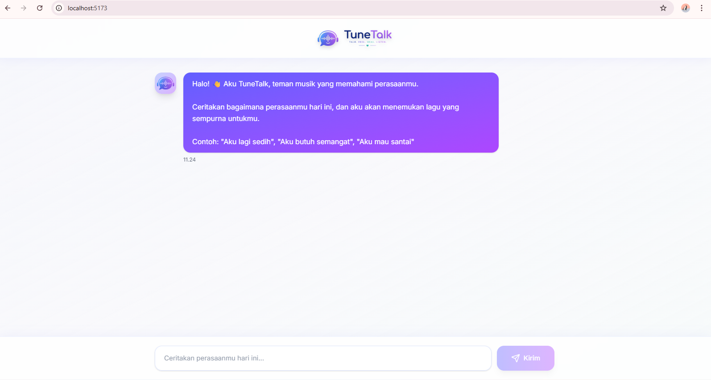
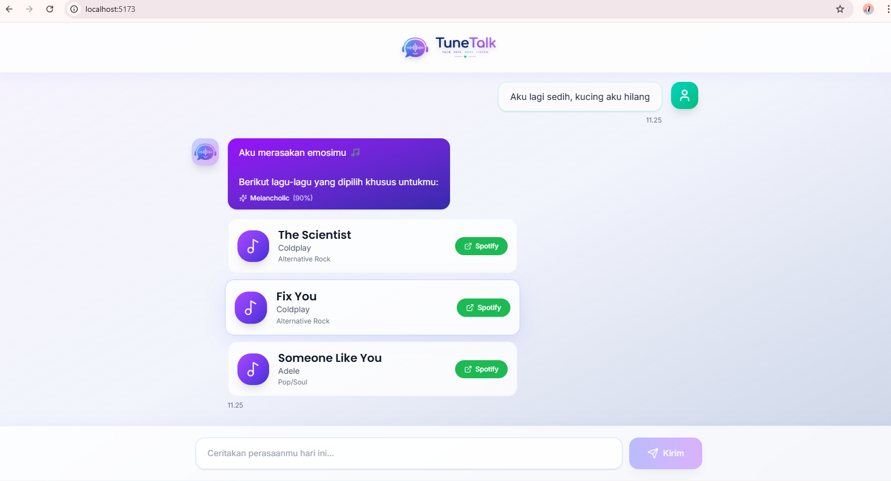

# 🎧 TuneTalk — Frontend

## 📌 Overview

TuneTalk is a **web-based chatbot interface** designed to:

- Provide **empathetic emotional support responses**
- Recommend **mood-based music playlists**

This frontend is part of an NLP-based system that processes user emotional input and returns supportive responses along with curated music suggestions.

## 🚀 Getting Started

### Step 1 - Clone the Repository

```bash
git clone https://github.com/Tune-Talk/fe-tunetalk.git
cd fe_model-tunetalk
```

> Fork this repository first! Replace `<your-org>` with the actual GitHub org/username.

### Step 2 - Install Dependencies

```bash
npm install
```

### Step 3 -Run Development Server

```bash
npm run dev
```

### Step 4 - Open in Browser

```
http://localhost:5173
```

## ✨ Features

### 💬 Chat Interface

- Accepts user emotional input (rant text)
- Displays messages in chat bubble format
- Scrollable conversation history

---

### ❤️ Empathetic Response

- Displays chatbot response as emotional support text
- Give emotional support text

---

### 🎵 Playlist Recommendation

- Displays songs in **card format**
- Each card includes:
  - Song title
  - Artist name
  - Mood tag
  - Spotify link

## 🔄 Frontend Flow

```
User Input
   ↓
Validate Input
   ↓
(Planned) Send Request via Axios
   ↓
Show Loading State
   ↓
Receive Response
   ↓
Render Chat Message
   ↓
Render Playlist Cards
```

---

## 📸 Screenshots

### Example Usage

#### Chat Interface



### Playlist Recommendation



## 🔌 API Integration (Planned)

### Endpoint

```
POST /api/chat
```

### Request Example

```json
{
  "user_id": "user_001",
  "message": "I feel happy because i finally found someone who treats me right in relationship"
}
```

### Expected Response (Frontend Consumption)

```json
{
  "emotion": "joy",
  "support_response": "That is a lot to be thankful for! You must be feeling really good! I hope this happy moment brings you even more beautiful experiences ahead. I have a music recommendation that matches your lovely mood!",
  "playlist": [
    {
      "title": "Song Title",
      "artist": "Artist Name",
      "mood_tag": "melancholic",
      "spotify_url": "https://open.spotify.com/track/..."
    }
  ]
}
```

## 🧠 System Context

This frontend is part of a larger system that includes:

- Emotion detection (RoBERTa / IndoBERT)
- Empathetic response generation (retrieval-based)
- Mood-to-music mapping (Valence-Arousal model)

The frontend acts as:

- User interaction layer
- Visualization layer for chatbot responses and playlists

---

## 🛠 Tech Stack

- **React (Vite)**
- **TypeScript**
- **Tailwind CSS**
- **Axios**

## 👨‍💻 Author

1. Melisa Olivia - 535240056 - Project Lead & Fullstack Developer
2. Jesicca Anastasya - 535240052 - Frontend Developer
3. Gabriela Levani - 535240038 - Fullstack Developer
